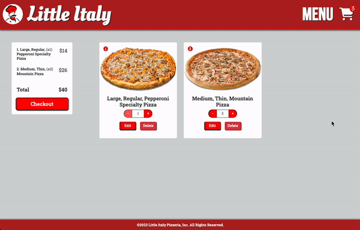
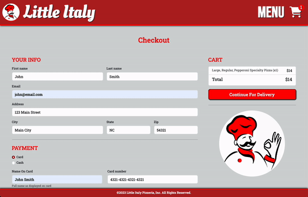

# Little Italy Pizza

Litlle Italy Pizza is a online web application for a fictitious pizza shop.
Created as a week-long pair programming project at GA Software Engineering Immersive Bootcamp.

## Feature

### Front-end
- Showcase the latest deals in the landing page.
- Select from a variety of prebuilt pizzas.
- Create a new pizza from a list of crust, ingredients and options in the pizza builder.
- Animation in the pizza builder showing ingredients being added.
- Add pizzas to the cart.
- In the cart display the total number of items and total price.
- Edit items in the cart accessing the pizza builder.
- Edit item quantity from the cart.
- Remove items from the cart.
- Complete and review order.
- Fill out a form in the checkout page with personal and payment information.
- Proceed to status page.
- Used cookie for session management to provide cart functionality.

### Back-end
- Used server side rendering with Node and Express to provide EJS template to the client.
- Confifured Express Router to handle application endpoints for GET, POST, PUT and DELETE methods. 
- Implemented full CRUD functionality with Model-View-Controller design pattern.
- Modelled the data structure with Mangoose database schema.
- Storing, accessing, editing data in a cloud database via asyncronose database calls.
- Application deployment on Heroku cloud platform.

## Screenshots

### Landing Page and Menu Page

### Custom Pizza Builder and Prebuilt Pizza Cards

### Edit, Delete Cart Items

### Checkout Page

### Error Handling

## Technologies Used

### MEN Stack Application

- Bootstrap 5
- EJS
- Express
- Mongoose
- Mongo DB
- Node
- HTML
- CSS
- JavaScript
- Heroku

## Icebox Feature

- [x] Ingredients animation.
- [ ] Multilanguage support.
- [ ] Order status page animation.
- [ ] Order status look-up via phone or email.
- [ ] Loading spinner.
- [ ] Create side items.
- [ ] Add coupon system.
- [ ] Add rewards program.
- [ ] Add a Store finder map.
- [ ] Add Login for staff member to access selling statistics.
- [ ] Pop-up Toast confirmation when pizza is added to the cart.
- [ ] Add popup dialog if order is made outside businnes hours.
- [ ] Schedule incoming order date/time.
- [ ] Clear credit card information after a timeout.
- [ ] Credit card processing with Square API.
- [ ] Promotional e-mail system.

